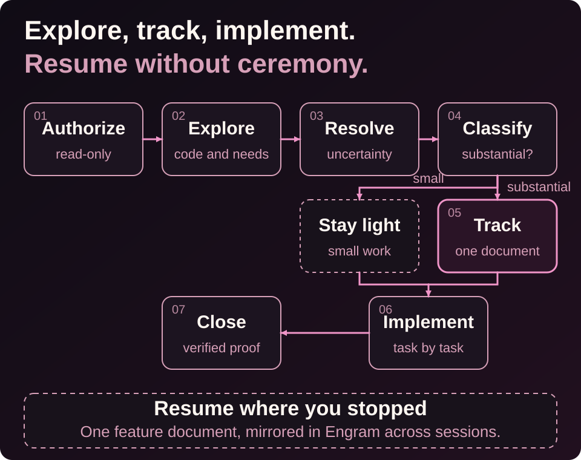
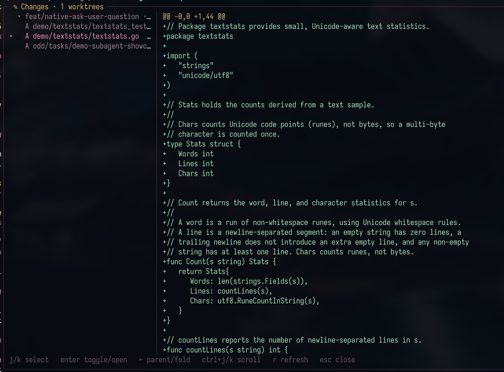
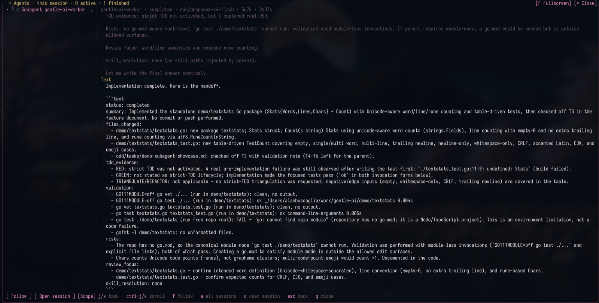
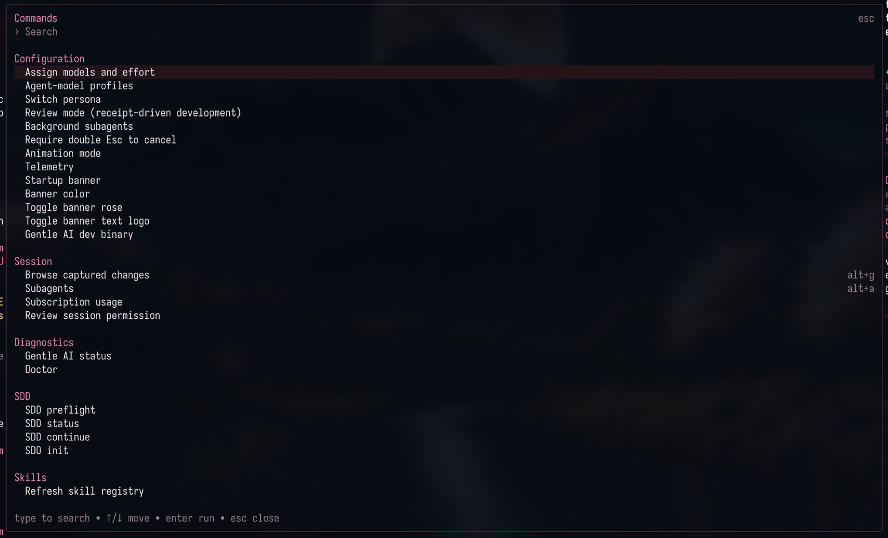
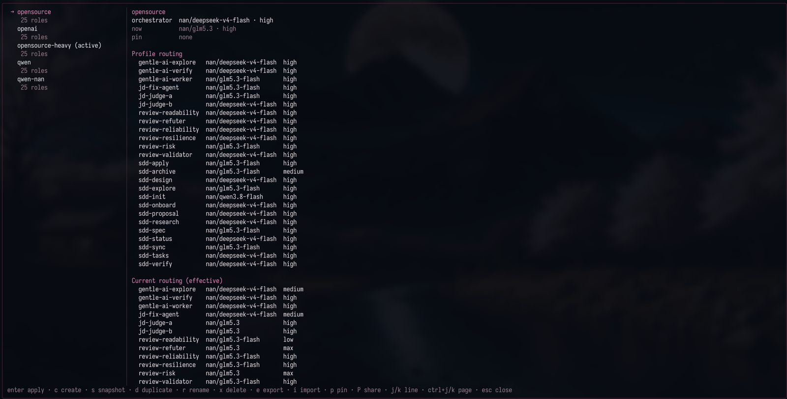

<a id="top"></a>

<div align="center">
  
</div>

<h1 align="center">gentle-shell™</h1>

<p align="center"><strong>Your coding agent for controlled development in the workspace you lead.</strong></p>

<p align="center">
  <a href="https://www.npmjs.com/package/gentle-pi"></a>
  <a href="https://pi.dev/packages/gentle-pi"></a>
  <a href="LICENSE"></a>
  <a href="https://github.com/Gentleman-Programming/gentle-pi/stargazers"></a>
  <a href="https://github.com/Gentleman-Programming/gentle-pi"></a>
</p>

<p align="center">
  <strong>
    <a href="https://gentle-ai.gentlemanprogramming.com/">Website</a>
    &nbsp;·&nbsp;
    <a href="#get-started">Quickstart</a>
    &nbsp;·&nbsp;
    <a href="#documentation">Docs</a>
    &nbsp;·&nbsp;
    <a href="https://gentle-ai-wiki.gentlemanprogramming.com/">Wiki</a>
  </strong>
</p>

<br>

<p align="center">Your terminal can run an agent. Your workspace should help you lead it.<br><strong>gentle-shell is your coding agent, bringing your changes, tasks, and engineering workflow together—built for Pi.</strong></p>

<p align="center"><sub>One workspace. A coding agent you direct. A workflow you can inspect.</sub></p>

<p align="center"><strong>BUILT FOR PI</strong> &nbsp;·&nbsp; Coding-agent workspace &nbsp;·&nbsp; Focused agents &nbsp;·&nbsp; ODD</p>

<p align="center">
  <a href="https://github.com/Gentleman-Programming/gentle-pi/stargazers"><strong>★ Star gentle-shell on GitHub</strong></a>
</p>

<div align="center">

<!--
  sealed_token is a GitHub fine-grained token encrypted against Star History's
  public key, so only the encrypted value is published here. It is required
  because GitHub restricted the stargazers API to a repository's admins and
  collaborators on 2026-06-30; without it the chart renders an error placeholder.
  Regenerate it at https://www.star-history.com/?repos=Gentleman-Programming%2Fgentle-pi&type=date&legend=top-left
-->

<a href="https://www.star-history.com/?repos=Gentleman-Programming%2Fgentle-pi&type=date&legend=top-left">
  <picture>
    <source media="(prefers-color-scheme: dark)" srcset="https://api.star-history.com/chart?repos=Gentleman-Programming%2Fgentle-pi&type=date&theme=dark&legend=top-left&sealed_token=zwrd_DfwYZeJU7nhGYNtREEheKWYEslW_uzrqORlZ36v-JSMepdqGLkKExp1M-xbNq6t-ebVS5iM3WoPDO26tXbSGkjXC2Jo3kHQ3uNzlRkCrWoqRHkPVQXvosKciY109ObiwGV1z8aajyedcloppmekCGrvVKJb6KWxGLXW_mHcRAVIBZUOa4SzW75D" />
    <source media="(prefers-color-scheme: light)" srcset="https://api.star-history.com/chart?repos=Gentleman-Programming%2Fgentle-pi&type=date&legend=top-left&sealed_token=zwrd_DfwYZeJU7nhGYNtREEheKWYEslW_uzrqORlZ36v-JSMepdqGLkKExp1M-xbNq6t-ebVS5iM3WoPDO26tXbSGkjXC2Jo3kHQ3uNzlRkCrWoqRHkPVQXvosKciY109ObiwGV1z8aajyedcloppmekCGrvVKJb6KWxGLXW_mHcRAVIBZUOa4SzW75D" />
    
  </picture>
</a>

<br>

<sub>Built for Pi. Shaped by Gentle-AI.</sub>

</div>

<p align="center">
  
</p>

## Features

---

### gentle-shell — Your coding agent, in the workspace you lead

<p align="center">

</p>

<strong>A complete workspace for the agent you direct.</strong> gentle-shell is your coding agent, built for Pi, with native workspace features for agent orchestration, usage monitoring for supported provider accounts, and built-in diff views—all in one integrated layout.

See active tasks, session changes, and runtime status without leaving the work you are leading.

<p align="center"><sub>gentle-shell in action. Screenshot from <a href="https://raw.githubusercontent.com/Gentleman-Programming/gentle-ai/main/docs/assets/features/gentle-shell.png">Gentle-AI</a>.</sub></p>

**[→ Read the gentle-shell reference](docs/gentle-shell.md)**

---

### el Gentleman — Think before you build

<p align="center">
  
</p>

Say what you need once, then keep moving. el Gentleman helps turn intent into clear scope, a sensible next step, and evidence people can review—without making every task feel like a process meeting.

**[→ Follow the organic workflow and recovery](docs/readme-reference.md#organic-driven-development)**

**[→ See persona modes and routing](docs/readme-reference.md#persona-modes)**

---

### Focused agents — Context with a return path

<p align="center">
  
</p>

Bring in help without losing the thread. Focused package-owned Pi agents can map a codebase, implement a bounded change, or verify it, while one parent stays accountable for the scope, the decisions, and the final summary.

**[→ Learn how work is routed](docs/readme-reference.md#how-the-harness-decides-what-to-do)**

- `orchestrator_session_id`, `orchestrator_list`, and `orchestrator_send_message` provide local-profile session notifications. List results advertise IDs only and reachability remains unknown. Sending selects the sole advertised peer or asks the user to choose; a successful ACK means the peer accepted the notification for delivery, not that it read or completed work. This is notification-and-ACK transport only: it has no cross-session queries, offline queue, retries, broadcasts, or read/completion guarantees. On Unix, presence records remain in the profile's private transport directory while socket endpoints use a private, profile-hashed directory below the canonical system temporary directory, keeping endpoint length independent of the profile path and at most 100 encoded bytes. The shared system temporary parent is only validated (current-user-owned without group/other write, or root/current-user-owned, world-writable, and sticky); it is never claimed, permissioned, or cleaned up by gentle-pi. On Windows, the transport selects a package-local PowerShell helper for a Windows named pipe; availability and delivery depend on the helper's bounded startup and pipe checks.

---

### ODD — The everyday workflow

<p align="center">
  
</p>

**Organic Driven Development (ODD)** is the recommended path for everyday work: explore the code, clarify real decisions, implement authorized changes, and run proportionate checks. Ask for an outcome, for example: "Add CSV export using the existing report filters." Small/read-only work needs no durable implementation artifacts; substantial work can use focused workers.

One `odd/tasks/<feature-name>.md` keeps objective/problem/why, scope/constraints, actionable tasks, evidence, progress, next step, and meaningful accepted-change rationale. Engram mirrors the full document under project-scoped `odd/<feature-name>/tasks`; accepted changes update intent and affected tasks while preserving valid completed work. Memory is separately installed; if unavailable, local progress survives with an explicitly pending mirror.

TDD follows configured mode, source, and exact runner, forwarded to workers and refreshed on resume. Tests existing does not enable it; disabled TDD still runs functional checks. Native RDD is separate and user-owned.

**[→ ODD details and recovery](docs/readme-reference.md#organic-driven-development)**

---

### Native review — Review the exact change

<p align="center">
  
</p>

Review the exact change, not a moving target. Native review keeps one candidate in view, returns risk-scoped evidence, and can surface a bounded correction path. You still decide what happens next in your repository.

**[→ Read the review integration boundary](docs/review-integration.md)**

---

### gentle-shell, feature by feature

Every workspace feature gentle-shell ships on top of Pi. Captured screenshots live in `docs/assets/features/`; slots still awaiting their image stay commented out.

#### Fullscreen workspace layout

At 140 columns or wider, one live header row (brand, cwd, branch, model · effort · profile, context gauge, session cost) sits over a transcript-and-rail split. The right rail scrolls **Status → Changes → TODO** as event-driven cards that repaint only when their own state changes — one card's update never redraws its neighbors.

<!-- <p align="center"></p> -->

#### Live status bar and prompt petal

Below 140 columns (or in regular mode) a compact single-line bar replaces pi's three-line footer: a context gauge that turns amber at 80% and red at 95%, session cost with `sub` for subscription logins, other extensions' statuses, and the session name. The prompt wraps in a rounded frame whose petal spins with `working` while the agent works and turns amber with `queued` when messages are waiting.

<!-- <p align="center"></p> -->

#### Gentle Changes — `/gentle:changes` · `alt+g`

Captured write/edit operations from the current agent session and its owned subagents — no repository scans on startup, no background polling. The two-pane viewer puts a worktree accordion on the left and the captured diff on the right, with keyboard and mouse navigation; `o` opens the real file in `$VISUAL`/`$EDITOR`. Per-worktree branch labels, `+42 −7` line counts, and an honest **diff unavailable** when an external edit breaks continuity — ownership is never mixed.

<p align="center"></p>

#### Gentle Agents — `/gentle:agents` · `alt+a`

Every subagent is its own `pi --mode rpc` child process. A live card above the editor shows each task with aligned `model · effort`, tokens, cost, and elapsed columns; `alt+a` opens a full-terminal overlay with retained semantic threads, a session/all-orchestrators scope switch, stop (`alt+s`), and completion, abort, and lost-exit history restored on resume. Task-mode children can ask you questions as ordinary Pi dialogs; background results return as rose cards that start a new turn — the model never polls.

<p align="center"></p>

#### Parent ↔ subagent communication

One parent session stays accountable while children run as isolated `pi --mode rpc` processes with their own sessions and optional worktrees. The handoff paths are explicit:

- **Delegate** — `subagent_run` (task or background mode) sends a self-contained task; the parent passes context and skill paths in, and receives a structured result back. `subagent_continue` resumes a finished task in its own session.
- **Steer mid-flight** — `subagent_send_message` delivers a message before the child's next model call; `subagent_cancel` stops it.
- **Children ask back** — a task-mode child's dialog (`select`, `confirm`, `input`, `editor`) reaches you as an ordinary Pi prompt; a programmatic `subagent_parent_message` query waits for exactly one correlated `subagent_reply` (30 seconds, at most four pending per child).
- **Background results** return as rose cards that start a new turn when the agent is idle — the model never polls.
- **Cross-session notifications** — `orchestrator_session_id`, `orchestrator_list`, and `orchestrator_send_message` provide notification-and-ACK transport within the local profile.
- **Worktree delegation** — `subagent_run.workspace_root` and `session_worktree_register` route children to a validated same-clone worktree.

#### Native interactive tools

gentle-shell ships its own tools instead of depending on third-party extensions — remove `npm:pi-subagents-j0k3r` and `npm:@juicesharp/rpiv-todo`; the built-ins replace them:

- **`ask_user_question`** — one to four structured questions in a single questionnaire, each with two to four options, multi-select, per-option descriptions and previews — rendered as real TUI dialogs, usable in the live session.
- **`ask_user_choice`** — one exactly representable single-select question, with an opt-in free-text response.
- **`todo`** — plan tracking with the Gentle Todo card (see above).
- **`gentle_review` / capture tools** — the native review surface for receipt-driven development.
- **Optional companions** (separately installed, never bundled): `gentle-engram` for persistent memory, `pi-web-access`, `pi-lens`, `pi-intercom`.

<!-- <p align="center"></p> -->

#### Gentle Todo

A plan-as-you-go task list with its own card. `write` replaces the whole plan in one call, every turn's prompt carries the open tasks, and a list that goes two turns untouched turns amber with `stale · N turns` until the model brings it current. `ctrl+shift+t` collapses the card to the task in progress.

<!-- <p align="center"></p> -->

#### Subscription usage — `/gentle:usage`

One panel for Codex, Claude Pro/Max, and NaN Cloud: per-window meters (5h, weekly, per-model allowances) with reset times, active provider first, family-grouped per-model rows, and the same amber-80%/red-95% gauges as the context meter. The bar always follows the active model; sidebar rows stop at the percentage, the panel carries the resets.

<!-- <p align="center"></p> -->

#### Command palette — `/gentle:commands` · `alt+k`

A curated, grouped menu of shell commands — Configuration, Session, Diagnostics, and Skills — with search by label, command name, or description. Entries appear only when actually registered; rebind with `GENTLE_PI_COMMANDS_KEY`.

<p align="center"></p>

#### Gentle notices

Calls into the gentle-ai binary, reviewer captures, and review preflight reminders render as rounded cards with amber/green/red rail states and collapsible results. The workflow stays visible in the transcript — never hidden behind a log.

<!-- <p align="center"></p> -->

#### Profiles and controls

Named `/gentle:profiles` route the orchestrator atomically and independently from packaged and review roles; a repository can pin its profile with `p`. Model, effort, persona, and profile are explicit knobs, and every card shares one border language — rose for whatever is alive.

<p align="center"></p>

**[→ Full shell reference](docs/gentle-shell.md)**

---

### What's new in v2.6.0

The [v2.6.0 release](https://github.com/Gentleman-Programming/gentle-pi/releases/tag/v2.6.0) brings a more persistent, inspectable Pi workspace:

- **Shell:** `/gentle:changes` groups captured write/edit changes from the current agent session and its subagents, without startup repository scans; fullscreen navigation, sidebars, and mouse support stay available. See the [capture limits and shell-command coverage](docs/gentle-shell.md#what-appears-in-changes).
- **Agents and profiles:** the Agents view shows orchestrator/session hierarchy, retained completion, abort, and lost-exit history, parent-child handoff, and model, effort, and usage observability. Named `/gentle:profiles` atomically route the orchestrator independently from packaged and review roles; applying one replaces the routing of every agent, a repository can be pinned to a profile with `p` so its subagent launches stop following the globally active profile, and the panel shows the routing the runtime actually uses even when `models.json` is sparse.
- **Control and recovery:** native SDD requires parent-confirmed preflight; native review supports intended-untracked selection, consent, and provider continuations. Subsystems install with explicit recovery guidance when npm lifecycle scripts were skipped; Pi Git installs are recognized globally; custom ask responses are opt-in. Windows keeps child consoles hidden and fixes ownership mode; Gentle Todo keeps the next pending task visible when collapsed.

---

### Also in the box

| Capability | What it brings to the workspace |
| --- | --- |
| Startup and runtime panel | A configurable gentle-shell entry point and visible runtime state for Pi. |
| Skills and delivery guidance | Package skills for documentation, issue work, PRs, reviews, and reviewable work units. |
| Model, effort, persona, and profile controls | Explicit knobs for how Pi routes and presents work. |
| Safety boundaries | Guards around destructive operations and sensitive-path handling. |
| Optional companion packages | Extra capabilities you may choose to add; persistent memory is **not** bundled with `gentle-pi`. |

<details>
<summary><strong>Optional companions, when they fit your setup</strong></summary>

<br>

| Package | Optional role |
| --- | --- |
| `pi-intercom` | Cross-session communication where your Pi setup supports it. |
| `gentle-engram` | Persistent memory, separately installed and configured. |
| `pi-web-access` | Web access when a task needs it and your policy allows it. |
| `pi-lens` | Additional inspection surfaces. |
| `@juicesharp/rpiv-ask-user-question` | Interactive choice support. |

These are companions, not hidden prerequisites or a claim that every Pi installation has every capability.

</details>

<p align="right"><a href="#top">Back to top ↑</a></p>

<p align="center">
  
</p>

## Get started

Install the stable release, restart Pi, then synchronize the installed assets.

> **Naming transition:** The product is called `gentle-shell`; the current npm package and repository remain `gentle-pi` until migration.

```bash
# Published stable release: v2.6.0
pi install npm:gentle-pi@2.6.0

# Restart Pi, then run:
gentle-ai sync

# Start Pi in your project
pi
```

See the [v2.6.0 release notes](https://github.com/Gentleman-Programming/gentle-pi/releases/tag/v2.6.0) for version-specific changes.

```text
/gentle:status
/gentle:doctor
```

> **RDD is opt-in:** enable native receipt-driven development only through an explicit `/gentle:review-mode enable` decision.

> **Fullscreen installation note:** a recognized global installation persists Pi’s `"tuiMode": "fullscreen"` setting. Project-local and other install paths do not receive that change.

For prerequisites, source-checkout instructions, full install behavior, and release policy, use the **[installation reference](docs/readme-reference.md#install)**. For everyday work, describe the outcome and follow [ODD](#odd--the-everyday-workflow).

<p align="right"><a href="#top">Back to top ↑</a></p>

<p align="center">
  
</p>

## Documentation

Start with the product-facing destination, then move into the operational reference only when you need the details.

| Destination | Purpose |
| --- | --- |
| [gentle-shell reference](docs/gentle-shell.md) | Workspace layout, changes, usage, agents, and todo interactions. |
| [ODD workflow](docs/readme-reference.md#organic-driven-development) · [Technical reference](docs/readme-reference.md) | Everyday work and recovery, optional SDD/OpenSpec, installation, configuration, commands, and contributor detail. |
| [Review integration](docs/review-integration.md) | The provider/consumer boundary for native review. |
| [Native authority architecture](docs/native-authority-architecture.md) | Ownership boundaries and review architecture. |
| [Telemetry](docs/telemetry.md) | Approved fields and source limitations. |
| [Delegated verification](docs/delegated-verification.md) | Practical verification guidance. |
| [Skill style guide](docs/skill-style-guide.md) | The package skill contract. |

<p align="right"><a href="#top">Back to top ↑</a></p>

<p align="center">
  
</p>

## Community

This project is built in public. Bring a real workflow, a sharp question, a bug report, or a small improvement that makes the next person’s work clearer.

<p align="center">
  <a href="https://github.com/Gentleman-Programming/gentle-pi/issues"></a>
  <a href="https://github.com/Gentleman-Programming/gentle-pi/graphs/contributors"></a>
  <a href="https://discord.com/invite/gentleman-programming-769863833996754944"></a>
</p>

<p align="center">
  <a href="https://github.com/Gentleman-Programming/gentle-pi/graphs/contributors"></a>
</p>

- Open an [issue](https://github.com/Gentleman-Programming/gentle-pi/issues) with the context needed to reproduce or understand the idea.
- See the people shaping the project in the [contributors graph](https://github.com/Gentleman-Programming/gentle-pi/graphs/contributors).
- Follow [Gentleman Programming](https://github.com/Gentleman-Programming) for the wider ecosystem.

<p align="right"><a href="#top">Back to top ↑</a></p>

<p align="center">
  
</p>

## About the author

`gentle-shell` is built by [Alan Buscaglia](https://github.com/Gentleman-Programming), the maker behind Gentleman Programming. It grew from a practical belief: capable agents are more useful when the human’s intent, review load, and delivery judgment stay visible all the way through the work.

Startup intro collaboration: thanks to [@aporcelli](https://github.com/aporcelli) and [`pi-gentle-startup`](https://github.com/aporcelli/pi-gentle-startup), which inspired the clean-screen startup animation, compact runtime panel, and pink visual treatment.

<p align="center">
  <a href="https://gentlemanprogramming.com/"></a>
  <a href="https://www.youtube.com/c/GentlemanProgramming"></a>
  <a href="https://github.com/Gentleman-Programming"></a>
</p>

<p align="right"><a href="#top">Back to top ↑</a></p>

<p align="center">
  
</p>

<p align="center"><strong>Built with the workflow it brings to Pi.</strong></p>

<p align="center">
  <a href="LICENSE"></a>
</p>

> **Trademark notice:** The gentle-shell™ and gentle-pi™ names and associated logos are trademarks of Alan Buscaglia. The MIT License applies to the code; it does not permit implying endorsement or official affiliation. See [TRADEMARKS.md](TRADEMARKS.md).
